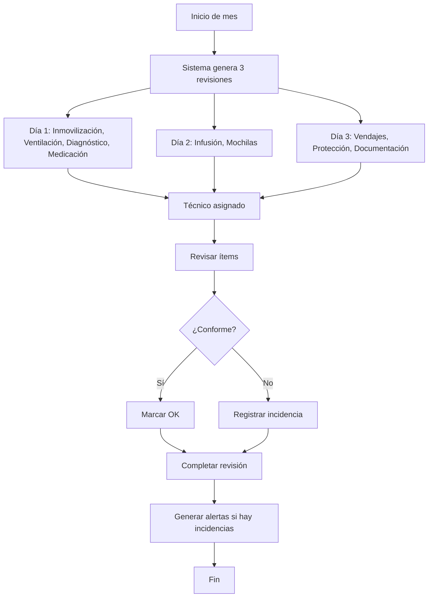
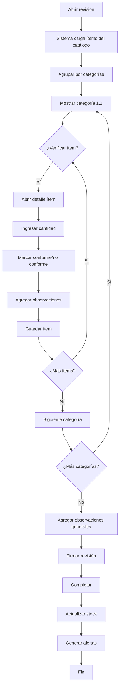
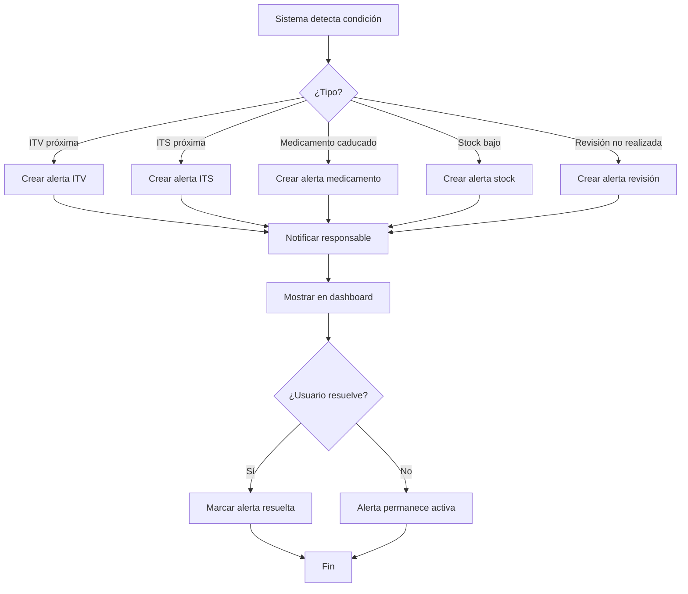

# SISTEMA DE REVISIONES DE AMBULANCIAS - DOCUMENTACIÓN TÉCNICA

**Fecha:** 07/02/2026
**Versión:** 1.0
**Proyecto:** Ambutrack

---

## 📋 ÍNDICE

1. [Introducción](#introducción)
2. [Tipos de Ambulancias](#tipos-de-ambulancias)
3. [Tipos de Revisiones](#tipos-de-revisiones)
4. [Estructura de Datos](#estructura-de-datos)
5. [Implementación Base de Datos (Supabase)](#implementación-base-de-datos-supabase)
6. [Implementación Mobile](#implementación-mobile)
7. [Implementación Web](#implementación-web)
8. [Flujos de Trabajo](#flujos-de-trabajo)

---

## 📖 INTRODUCCIÓN

El sistema de revisiones de ambulancias permite gestionar y registrar las inspecciones periódicas obligatorias de vehículos sanitarios según la norma **EN 1789:2021**.

### Objetivos del Sistema

- ✅ Garantizar que todas las ambulancias cumplan con los protocolos de revisión
- ✅ Digitalizar el proceso de inspección mensual
- ✅ Rastrear equipamiento, medicación y caducidades
- ✅ Generar alertas de revisiones pendientes
- ✅ Mantener histórico de revisiones
- ✅ Facilitar auditorías ITS (Inspección Técnica Sanitaria)

---

## 🚑 TIPOS DE AMBULANCIAS

| Tipo | Nombre | Descripción | Equipamiento |
|------|--------|-------------|--------------|
| **A1** | Ambulancia Asistencial | Soporte Vital Básico | Básico |
| **A1EE** | Ambulancia Asistencial Especial | Soporte Vital Básico + Equipo Especial | Básico + Especial |
| **A2** | Ambulancia de Transporte | Transporte no urgente | Mínimo |
| **B** | Ambulancia Asistencial | Soporte Vital Básico | Básico |
| **C** | Ambulancia Medicalizada | Soporte Vital Avanzado (SVA) | Avanzado + Medicación |

### Diferencias Clave

- **A2**: Silla sube escalera eléctrica, equipamiento mínimo
- **A1/B/A1EE**: Equipamiento básico de emergencias
- **C (SVA)**: Desfibrilador con monitor, EKG 12 derivaciones, medicación amplia, ventilador automático

---

## 🗓️ TIPOS DE REVISIONES

### 1. Revisión Mensual (PRINCIPAL)

**Frecuencia:** Mensual
**Método:** Dividida en 3 días (Día 1, Día 2, Día 3)

#### 📅 Día 1 de cada mes
- **1.1** Equipos de inmovilización y traslados de paciente
- **1.2** Equipos de ventilación y respiración
- **1.3** Equipo de diagnóstico que peligra la vida
- **Tabla medicación y nevera**

#### 📅 Día 2 de cada mes
- **1.4** Equipo de infusión
- **1.5** Mochilas de intervención de curas y mochila vía aérea

#### 📅 Día 3 de cada mes
- **1.6** Productos de vendajes y asistencia sanitaria
- **1.7** Equipos de protección y rescate
- **1.8** Documentación (ITS, ITV, seguro, etc.)

### 2. Revisiones Adicionales (Futuras)

| Tipo | Frecuencia | Estado |
|------|-----------|--------|
| Diaria | Diaria | 🔜 No documentada |
| Trimestral | Cada 3 meses | 🔜 No documentada |
| Anual | Anual | 🔜 No documentada |
| Pre-servicio | Antes de cada servicio | 🔜 No documentada |

---

## 🗄️ ESTRUCTURA DE DATOS

### Entidades Principales

```
┌─────────────────────┐
│   AMBULANCIAS       │
│   (Vehículos)       │
└──────────┬──────────┘
           │
           │ 1:N
           ▼
┌─────────────────────┐
│  REVISIONES         │
│  (Registros)        │
└──────────┬──────────┘
           │
           │ 1:N
           ▼
┌─────────────────────┐
│ ITEMS_REVISION      │
│ (Equipos/Checks)    │
└─────────────────────┘
```

### Catálogos

```
┌─────────────────────┐      ┌─────────────────────┐
│  TIPOS_AMBULANCIA   │      │  CATEGORIAS_EQUIPO  │
│  (A1, A2, B, C)     │      │  (8 categorías)     │
└─────────────────────┘      └─────────────────────┘

┌─────────────────────┐      ┌─────────────────────┐
│  EQUIPOS_CATALOGO   │      │  MEDICAMENTOS       │
│  (Equipamiento)     │      │  (Medicación)       │
└─────────────────────┘      └─────────────────────┘
```

---

## 💾 IMPLEMENTACIÓN BASE DE DATOS (SUPABASE)

### Esquema de Tablas

#### 1. `amb_tipos_ambulancia`

```sql
CREATE TABLE amb_tipos_ambulancia (
  id UUID PRIMARY KEY DEFAULT uuid_generate_v4(),
  codigo TEXT UNIQUE NOT NULL,  -- 'A1', 'A2', 'B', 'C', 'A1EE'
  nombre TEXT NOT NULL,
  descripcion TEXT,
  nivel_equipamiento TEXT,  -- 'basico', 'avanzado', 'minimo'
  created_at TIMESTAMPTZ DEFAULT now(),
  updated_at TIMESTAMPTZ DEFAULT now()
);
```

#### 2. `amb_ambulancias`

```sql
CREATE TABLE amb_ambulancias (
  id UUID PRIMARY KEY DEFAULT uuid_generate_v4(),
  empresa_id UUID NOT NULL REFERENCES empresas(id),
  tipo_ambulancia_id UUID NOT NULL REFERENCES amb_tipos_ambulancia(id),

  -- Identificación
  matricula TEXT UNIQUE NOT NULL,
  numero_identificacion TEXT,  -- Número interno (ej: "A-001")
  marca TEXT,
  modelo TEXT,

  -- Estado
  estado TEXT NOT NULL DEFAULT 'activa',  -- 'activa', 'mantenimiento', 'baja'

  -- Documentación
  fecha_itv DATE,
  fecha_its DATE,  -- Inspección Técnica Sanitaria
  fecha_seguro DATE,
  numero_poliza_seguro TEXT,

  -- Normas
  certificado_norma_une BOOLEAN DEFAULT false,
  certificado_nica TEXT,  -- N.I.C.A (autorización centro sanitario)

  created_at TIMESTAMPTZ DEFAULT now(),
  updated_at TIMESTAMPTZ DEFAULT now()
);
```

#### 3. `amb_categorias_equipamiento`

```sql
CREATE TABLE amb_categorias_equipamiento (
  id UUID PRIMARY KEY DEFAULT uuid_generate_v4(),
  codigo TEXT UNIQUE NOT NULL,
  nombre TEXT NOT NULL,
  orden INTEGER NOT NULL,  -- Orden de presentación
  dia_revision INTEGER,  -- 1, 2, 3 (día de la revisión mensual)
  icono TEXT,  -- Nombre del icono
  color TEXT,  -- Color en hex
  created_at TIMESTAMPTZ DEFAULT now()
);

-- Categorías base
INSERT INTO amb_categorias_equipamiento (codigo, nombre, orden, dia_revision, icono, color) VALUES
  ('inmovilizacion', 'Equipos de Inmovilización y Traslado', 1, 1, 'stretcher', '#3B82F6'),
  ('ventilacion', 'Equipos de Ventilación y Respiración', 2, 1, 'wind', '#10B981'),
  ('diagnostico', 'Equipo de Diagnóstico', 3, 1, 'activity', '#EF4444'),
  ('medicacion', 'Medicación y Nevera', 4, 1, 'pill', '#8B5CF6'),
  ('infusion', 'Equipo de Infusión', 5, 2, 'droplet', '#06B6D4'),
  ('mochilas', 'Mochilas de Intervención', 6, 2, 'briefcase-medical', '#F59E0B'),
  ('vendajes', 'Vendajes y Asistencia Sanitaria', 7, 3, 'bandage', '#EC4899'),
  ('proteccion', 'Protección y Rescate', 8, 3, 'shield', '#6366F1'),
  ('documentacion', 'Documentación', 9, 3, 'file-text', '#64748B');
```

#### 4. `amb_equipos_catalogo`

```sql
CREATE TABLE amb_equipos_catalogo (
  id UUID PRIMARY KEY DEFAULT uuid_generate_v4(),
  categoria_id UUID NOT NULL REFERENCES amb_categorias_equipamiento(id),

  nombre TEXT NOT NULL,
  descripcion TEXT,
  unidad_medida TEXT,  -- 'unidad', 'juego', 'litros', etc.
  cantidad_minima INTEGER,

  -- Aplicabilidad por tipo de ambulancia
  aplica_a1 BOOLEAN DEFAULT true,
  aplica_a1ee BOOLEAN DEFAULT true,
  aplica_a2 BOOLEAN DEFAULT true,
  aplica_b BOOLEAN DEFAULT true,
  aplica_c BOOLEAN DEFAULT true,

  -- Control de stock
  controla_stock BOOLEAN DEFAULT false,
  tiene_caducidad BOOLEAN DEFAULT false,

  created_at TIMESTAMPTZ DEFAULT now(),
  updated_at TIMESTAMPTZ DEFAULT now()
);
```

#### 5. `amb_medicamentos`

```sql
CREATE TABLE amb_medicamentos (
  id UUID PRIMARY KEY DEFAULT uuid_generate_v4(),

  -- Identificación
  principio_activo TEXT NOT NULL,
  nombre_comercial TEXT NOT NULL,
  presentacion TEXT,  -- 'ampolla', 'vial', 'comprimido', etc.

  -- Stock
  stock_minimo INTEGER NOT NULL,
  stock_maximo INTEGER,

  -- Refrigeración
  requiere_nevera BOOLEAN DEFAULT false,
  temperatura_min DECIMAL(4,1),  -- °C
  temperatura_max DECIMAL(4,1),  -- °C

  -- Aplicabilidad
  aplica_tipo_c BOOLEAN DEFAULT true,  -- Solo SVA normalmente

  created_at TIMESTAMPTZ DEFAULT now(),
  updated_at TIMESTAMPTZ DEFAULT now()
);
```

#### 6. `amb_revisiones`

```sql
CREATE TABLE amb_revisiones (
  id UUID PRIMARY KEY DEFAULT uuid_generate_v4(),
  ambulancia_id UUID NOT NULL REFERENCES amb_ambulancias(id),

  -- Identificación de la revisión
  tipo_revision TEXT NOT NULL DEFAULT 'mensual',  -- 'mensual', 'diaria', 'trimestral', 'anual'
  periodo TEXT NOT NULL,  -- 'ENERO-2026', 'FEBRERO-2026'
  dia_revision INTEGER,  -- 1, 2, 3 (para mensuales divididas en días)

  -- Fechas
  fecha_programada DATE NOT NULL,
  fecha_realizada TIMESTAMPTZ,

  -- Responsable
  tecnico_id UUID REFERENCES usuarios(id),
  tecnico_nombre TEXT NOT NULL,  -- MAYÚSCULAS

  -- Estado
  estado TEXT NOT NULL DEFAULT 'pendiente',  -- 'pendiente', 'en_progreso', 'completada', 'con_incidencias'

  -- Resultados
  observaciones TEXT,
  incidencias TEXT[],  -- Array de incidencias detectadas

  created_at TIMESTAMPTZ DEFAULT now(),
  updated_at TIMESTAMPTZ DEFAULT now()
);

-- Índices
CREATE INDEX idx_revisiones_ambulancia ON amb_revisiones(ambulancia_id);
CREATE INDEX idx_revisiones_estado ON amb_revisiones(estado);
CREATE INDEX idx_revisiones_fecha_programada ON amb_revisiones(fecha_programada);
```

#### 7. `amb_items_revision`

```sql
CREATE TABLE amb_items_revision (
  id UUID PRIMARY KEY DEFAULT uuid_generate_v4(),
  revision_id UUID NOT NULL REFERENCES amb_revisiones(id) ON DELETE CASCADE,
  equipo_id UUID REFERENCES amb_equipos_catalogo(id),
  medicamento_id UUID REFERENCES amb_medicamentos(id),
  categoria_id UUID NOT NULL REFERENCES amb_categorias_equipamiento(id),

  -- Datos del ítem
  nombre TEXT NOT NULL,
  descripcion TEXT,
  cantidad_esperada INTEGER,

  -- Resultado de la verificación
  verificado BOOLEAN DEFAULT false,
  conforme BOOLEAN,  -- true = OK, false = No conforme, null = no verificado
  cantidad_encontrada INTEGER,

  -- Observaciones específicas
  observaciones TEXT,
  requiere_reposicion BOOLEAN DEFAULT false,

  -- Caducidad (para medicamentos y material con caducidad)
  fecha_caducidad DATE,
  caducado BOOLEAN,

  -- Metadata
  verificado_en TIMESTAMPTZ,
  verificado_por UUID REFERENCES usuarios(id),

  created_at TIMESTAMPTZ DEFAULT now()
);

-- Índices
CREATE INDEX idx_items_revision ON amb_items_revision(revision_id);
CREATE INDEX idx_items_equipo ON amb_items_revision(equipo_id);
CREATE INDEX idx_items_medicamento ON amb_items_revision(medicamento_id);
```

#### 8. `amb_stock_ambulancia`

```sql
CREATE TABLE amb_stock_ambulancia (
  id UUID PRIMARY KEY DEFAULT uuid_generate_v4(),
  ambulancia_id UUID NOT NULL REFERENCES amb_ambulancias(id),
  equipo_id UUID REFERENCES amb_equipos_catalogo(id),
  medicamento_id UUID REFERENCES amb_medicamentos(id),

  -- Stock actual
  cantidad_actual INTEGER NOT NULL DEFAULT 0,
  fecha_caducidad DATE,
  lote TEXT,

  -- Control
  ultima_actualizacion TIMESTAMPTZ DEFAULT now(),
  actualizado_por UUID REFERENCES usuarios(id),

  created_at TIMESTAMPTZ DEFAULT now(),
  updated_at TIMESTAMPTZ DEFAULT now(),

  -- Constraint: debe ser equipo o medicamento, no ambos
  CONSTRAINT chk_equipo_o_medicamento CHECK (
    (equipo_id IS NOT NULL AND medicamento_id IS NULL) OR
    (equipo_id IS NULL AND medicamento_id IS NOT NULL)
  )
);

-- Índices
CREATE INDEX idx_stock_ambulancia ON amb_stock_ambulancia(ambulancia_id);
CREATE UNIQUE INDEX idx_stock_unique ON amb_stock_ambulancia(ambulancia_id, COALESCE(equipo_id, '00000000-0000-0000-0000-000000000000'::UUID), COALESCE(medicamento_id, '00000000-0000-0000-0000-000000000000'::UUID));
```

#### 9. `amb_alertas`

```sql
CREATE TABLE amb_alertas (
  id UUID PRIMARY KEY DEFAULT uuid_generate_v4(),
  ambulancia_id UUID NOT NULL REFERENCES amb_ambulancias(id),

  tipo_alerta TEXT NOT NULL,  -- 'revision_pendiente', 'itv_proxima', 'its_proxima', 'medicamento_caducado', 'stock_bajo'
  prioridad TEXT NOT NULL DEFAULT 'media',  -- 'alta', 'media', 'baja'

  titulo TEXT NOT NULL,
  descripcion TEXT,

  -- Datos relacionados
  fecha_vencimiento DATE,
  referencia_id UUID,  -- ID del item relacionado (revisión, medicamento, etc.)

  -- Estado
  estado TEXT NOT NULL DEFAULT 'activa',  -- 'activa', 'resuelta', 'descartada'
  fecha_resolucion TIMESTAMPTZ,
  resuelto_por UUID REFERENCES usuarios(id),

  created_at TIMESTAMPTZ DEFAULT now(),
  updated_at TIMESTAMPTZ DEFAULT now()
);

-- Índices
CREATE INDEX idx_alertas_ambulancia ON amb_alertas(ambulancia_id);
CREATE INDEX idx_alertas_estado ON amb_alertas(estado);
CREATE INDEX idx_alertas_prioridad ON amb_alertas(prioridad);
```

### Políticas RLS (Row Level Security)

```sql
-- Habilitar RLS
ALTER TABLE amb_ambulancias ENABLE ROW LEVEL SECURITY;
ALTER TABLE amb_revisiones ENABLE ROW LEVEL SECURITY;
ALTER TABLE amb_items_revision ENABLE ROW LEVEL SECURITY;
ALTER TABLE amb_stock_ambulancia ENABLE ROW LEVEL SECURITY;
ALTER TABLE amb_alertas ENABLE ROW LEVEL SECURITY;

-- Política: Los usuarios solo ven las ambulancias de su empresa
CREATE POLICY "Usuarios ven ambulancias de su empresa"
ON amb_ambulancias FOR SELECT
USING (
  empresa_id IN (
    SELECT empresa_id FROM usuarios WHERE id = auth.uid()
  )
);

-- Política: Los usuarios pueden crear revisiones de ambulancias de su empresa
CREATE POLICY "Usuarios crean revisiones de su empresa"
ON amb_revisiones FOR INSERT
WITH CHECK (
  ambulancia_id IN (
    SELECT id FROM amb_ambulancias WHERE empresa_id IN (
      SELECT empresa_id FROM usuarios WHERE id = auth.uid()
    )
  )
);

-- Similar para otras tablas...
```

### Funciones Útiles

#### Generar revisiones mensuales automáticamente

```sql
CREATE OR REPLACE FUNCTION generar_revisiones_mes(
  p_ambulancia_id UUID,
  p_mes INTEGER,
  p_anio INTEGER
)
RETURNS VOID AS $$
DECLARE
  v_periodo TEXT;
  v_tipo_ambulancia_codigo TEXT;
BEGIN
  -- Formato del periodo: "ENERO-2026"
  v_periodo := TO_CHAR(TO_DATE(p_mes::TEXT, 'MM'), 'TMMonth') || '-' || p_anio;

  -- Obtener tipo de ambulancia
  SELECT ta.codigo INTO v_tipo_ambulancia_codigo
  FROM amb_ambulancias a
  JOIN amb_tipos_ambulancia ta ON a.tipo_ambulancia_id = ta.id
  WHERE a.id = p_ambulancia_id;

  -- Crear revisión para Día 1
  INSERT INTO amb_revisiones (ambulancia_id, tipo_revision, periodo, dia_revision, fecha_programada, tecnico_nombre)
  VALUES (
    p_ambulancia_id,
    'mensual',
    v_periodo,
    1,
    DATE(p_anio || '-' || LPAD(p_mes::TEXT, 2, '0') || '-01'),
    'PENDIENTE ASIGNAR'
  );

  -- Crear revisión para Día 2
  INSERT INTO amb_revisiones (ambulancia_id, tipo_revision, periodo, dia_revision, fecha_programada, tecnico_nombre)
  VALUES (
    p_ambulancia_id,
    'mensual',
    v_periodo,
    2,
    DATE(p_anio || '-' || LPAD(p_mes::TEXT, 2, '0') || '-02'),
    'PENDIENTE ASIGNAR'
  );

  -- Crear revisión para Día 3
  INSERT INTO amb_revisiones (ambulancia_id, tipo_revision, periodo, dia_revision, fecha_programada, tecnico_nombre)
  VALUES (
    p_ambulancia_id,
    'mensual',
    v_periodo,
    3,
    DATE(p_anio || '-' || LPAD(p_mes::TEXT, 2, '0') || '-03'),
    'PENDIENTE ASIGNAR'
  );
END;
$$ LANGUAGE plpgsql;
```

#### Generar items de revisión basados en el catálogo

```sql
CREATE OR REPLACE FUNCTION generar_items_revision(
  p_revision_id UUID
)
RETURNS VOID AS $$
DECLARE
  v_dia_revision INTEGER;
  v_tipo_ambulancia_codigo TEXT;
  v_ambulancia_id UUID;
  r_equipo RECORD;
BEGIN
  -- Obtener datos de la revisión
  SELECT r.dia_revision, r.ambulancia_id, ta.codigo
  INTO v_dia_revision, v_ambulancia_id, v_tipo_ambulancia_codigo
  FROM amb_revisiones r
  JOIN amb_ambulancias a ON r.ambulancia_id = a.id
  JOIN amb_tipos_ambulancia ta ON a.tipo_ambulancia_id = ta.id
  WHERE r.id = p_revision_id;

  -- Insertar items según el día de revisión y tipo de ambulancia
  FOR r_equipo IN
    SELECT e.*, c.id as categoria_id
    FROM amb_equipos_catalogo e
    JOIN amb_categorias_equipamiento c ON e.categoria_id = c.id
    WHERE c.dia_revision = v_dia_revision
      AND (
        (v_tipo_ambulancia_codigo = 'A1' AND e.aplica_a1) OR
        (v_tipo_ambulancia_codigo = 'A1EE' AND e.aplica_a1ee) OR
        (v_tipo_ambulancia_codigo = 'A2' AND e.aplica_a2) OR
        (v_tipo_ambulancia_codigo = 'B' AND e.aplica_b) OR
        (v_tipo_ambulancia_codigo = 'C' AND e.aplica_c)
      )
  LOOP
    INSERT INTO amb_items_revision (
      revision_id,
      equipo_id,
      categoria_id,
      nombre,
      descripcion,
      cantidad_esperada
    ) VALUES (
      p_revision_id,
      r_equipo.id,
      r_equipo.categoria_id,
      r_equipo.nombre,
      r_equipo.descripcion,
      r_equipo.cantidad_minima
    );
  END LOOP;

END;
$$ LANGUAGE plpgsql;
```

---

## 📱 IMPLEMENTACIÓN MOBILE

### Arquitectura

```
lib/features/revisiones_ambulancias/
├── domain/
│   └── (usar entities desde core/datasources)
├── data/
│   └── repositories/
│       └── revision_repository_impl.dart
└── presentation/
    ├── blocs/
    │   ├── revision_list_bloc.dart
    │   ├── revision_detail_bloc.dart
    │   └── revision_form_bloc.dart
    ├── pages/
    │   ├── revisiones_list_page.dart
    │   ├── revision_detail_page.dart
    │   ├── revision_form_page.dart
    │   └── ambulancia_detail_page.dart
    └── widgets/
        ├── categoria_card.dart
        ├── item_revision_tile.dart
        ├── badge_estado_revision.dart
        └── progreso_revision.dart
```

### Pantallas Principales

#### 1. **Lista de Ambulancias**

**Ruta:** `/ambulancias`

**Funcionalidad:**
- Listar todas las ambulancias de la empresa
- Filtrar por tipo (A1, A2, B, C)
- Filtrar por estado (activa, mantenimiento, baja)
- Ver alertas pendientes por ambulancia
- Acceder a detalle de ambulancia

**Diseño:**
```dart
ListView con cards que muestran:
- Matrícula
- Tipo de ambulancia (badge)
- Estado (badge con colores)
- Próxima revisión
- Alertas activas (contador)
```

#### 2. **Detalle de Ambulancia**

**Ruta:** `/ambulancias/:id`

**Funcionalidad:**
- Ver información completa de la ambulancia
- Ver documentación (ITV, ITS, seguro)
- Ver alertas activas
- Ver histórico de revisiones
- Acceder a crear nueva revisión
- Ver stock actual

**Secciones:**
- Información general
- Documentación
- Revisiones (histórico)
- Alertas
- Stock

#### 3. **Lista de Revisiones**

**Ruta:** `/ambulancias/:id/revisiones`

**Funcionalidad:**
- Listar revisiones por estado (pendientes, completadas, con incidencias)
- Filtrar por periodo
- Filtrar por día de revisión (1, 2, 3)
- Ver progreso de revisiones en curso

**Diseño:**
```dart
Tabs:
- Pendientes
- En Progreso
- Completadas

Cards con:
- Periodo (ej: "ENERO-2026 - Día 1")
- Estado
- Progreso (ej: 15/45 items verificados)
- Fecha programada
- Técnico asignado
```

#### 4. **Formulario de Revisión** (PRINCIPAL)

**Ruta:** `/revisiones/:id/realizar`

**Funcionalidad:**
- Realizar la revisión item por item
- Agrupar items por categoría (acordeón)
- Marcar items como conformes / no conformes
- Registrar cantidad encontrada
- Agregar observaciones por item
- Capturar caducidades
- Tomar fotos de evidencias (futuro)
- Guardar progreso parcial
- Completar revisión

**Diseño:**

```dart
Scaffold(
  appBar: AppBar(
    title: "Revisión ENERO-2026 - Día 1",
    actions: [
      IconButton(
        icon: Icon(Icons.save),
        onPressed: guardarProgreso,
      )
    ],
  ),
  body: Column(
    children: [
      // Barra de progreso
      LinearProgressIndicator(value: progreso),

      // Indicador de progreso
      Padding(
        padding: EdgeInsets.all(16),
        child: Text("15 de 45 items verificados"),
      ),

      // Lista de categorías (acordeón)
      Expanded(
        child: ListView(
          children: [
            ExpansionTile(
              title: Row(
                children: [
                  Icon(Icons.stretcher, color: Colors.blue),
                  SizedBox(width: 8),
                  Text("1.1 Inmovilización y Traslado"),
                  Spacer(),
                  CircularProgressIndicator(value: 0.8),
                ],
              ),
              children: [
                // Items de la categoría
                ItemRevisionTile(...),
                ItemRevisionTile(...),
              ],
            ),

            ExpansionTile(
              title: Row(
                children: [
                  Icon(Icons.wind, color: Colors.green),
                  SizedBox(width: 8),
                  Text("1.2 Ventilación y Respiración"),
                  Spacer(),
                  CircularProgressIndicator(value: 0.5),
                ],
              ),
              children: [
                ItemRevisionTile(...),
              ],
            ),
          ],
        ),
      ),

      // Botones de acción
      Padding(
        padding: EdgeInsets.all(16),
        child: Row(
          children: [
            Expanded(
              child: OutlinedButton(
                onPressed: guardarBorrador,
                child: Text("Guardar Borrador"),
              ),
            ),
            SizedBox(width: 16),
            Expanded(
              child: ElevatedButton(
                onPressed: completarRevision,
                child: Text("Completar"),
              ),
            ),
          ],
        ),
      ),
    ],
  ),
);
```

#### 5. **Widget: Item de Revisión**

```dart
class ItemRevisionTile extends StatelessWidget {
  final ItemRevision item;
  final Function(bool) onChanged;

  @override
  Widget build(BuildContext context) {
    return Card(
      child: ExpansionTile(
        leading: Checkbox(
          value: item.verificado,
          onChanged: onChanged,
        ),
        title: Text(item.nombre),
        subtitle: Text("Cantidad esperada: ${item.cantidadEsperada}"),
        trailing: item.conforme == null
          ? Icon(Icons.pending, color: Colors.grey)
          : item.conforme
            ? Icon(Icons.check_circle, color: Colors.green)
            : Icon(Icons.error, color: Colors.red),
        children: [
          Padding(
            padding: EdgeInsets.all(16),
            child: Column(
              crossAxisAlignment: CrossAxisAlignment.start,
              children: [
                // Campo cantidad
                TextFormField(
                  decoration: InputDecoration(
                    labelText: "Cantidad encontrada",
                  ),
                  keyboardType: TextInputType.number,
                  initialValue: item.cantidadEncontrada?.toString(),
                  onChanged: (value) {
                    // Actualizar cantidad
                  },
                ),

                SizedBox(height: 16),

                // Radio buttons: Conforme / No conforme
                Row(
                  children: [
                    Text("Estado:"),
                    SizedBox(width: 16),
                    Radio(
                      value: true,
                      groupValue: item.conforme,
                      onChanged: (value) {
                        // Marcar como conforme
                      },
                    ),
                    Text("Conforme"),
                    Radio(
                      value: false,
                      groupValue: item.conforme,
                      onChanged: (value) {
                        // Marcar como no conforme
                      },
                    ),
                    Text("No conforme"),
                  ],
                ),

                SizedBox(height: 16),

                // Observaciones
                TextFormField(
                  decoration: InputDecoration(
                    labelText: "Observaciones",
                    hintText: "Notas adicionales...",
                  ),
                  maxLines: 3,
                  initialValue: item.observaciones,
                  onChanged: (value) {
                    // Actualizar observaciones
                  },
                ),

                // Caducidad (si aplica)
                if (item.tieneCaducidad)
                  Column(
                    children: [
                      SizedBox(height: 16),
                      InkWell(
                        onTap: () async {
                          // Selector de fecha
                        },
                        child: InputDecorator(
                          decoration: InputDecoration(
                            labelText: "Fecha de caducidad",
                          ),
                          child: Text(
                            item.fechaCaducidad != null
                              ? DateFormat('dd/MM/yyyy').format(item.fechaCaducidad)
                              : "Seleccionar fecha",
                          ),
                        ),
                      ),
                    ],
                  ),
              ],
            ),
          ),
        ],
      ),
    );
  }
}
```

### Estados de la Revisión

```dart
enum EstadoRevision {
  pendiente,
  enProgreso,
  completada,
  conIncidencias,
}

extension EstadoRevisionExtension on EstadoRevision {
  String get nombre {
    switch (this) {
      case EstadoRevision.pendiente:
        return 'Pendiente';
      case EstadoRevision.enProgreso:
        return 'En Progreso';
      case EstadoRevision.completada:
        return 'Completada';
      case EstadoRevision.conIncidencias:
        return 'Con Incidencias';
    }
  }

  Color get color {
    switch (this) {
      case EstadoRevision.pendiente:
        return AppColors.warning;
      case EstadoRevision.enProgreso:
        return AppColors.info;
      case EstadoRevision.completada:
        return AppColors.success;
      case EstadoRevision.conIncidencias:
        return AppColors.error;
    }
  }
}
```

### Características Mobile

1. **Modo Offline:** Permitir trabajar sin conexión y sincronizar después
2. **Firma Digital:** Capturar firma del técnico al completar
3. **Fotos de Evidencia:** Adjuntar fotos de equipos o incidencias
4. **Escaneo QR:** Escanear códigos QR de equipos/medicamentos
5. **Notificaciones Push:** Alertar sobre revisiones pendientes
6. **Exportación PDF:** Generar PDF del protocolo completado

---

## 💻 IMPLEMENTACIÓN WEB

### Rutas Principales

```typescript
/ambulancias
/ambulancias/:id
/ambulancias/:id/revisiones
/revisiones/:id/realizar
/revisiones/:id/reporte
/configuracion/equipos
/configuracion/medicamentos
/alertas
/reportes
```

### Vistas Principales

#### 1. **Dashboard de Ambulancias**

**Funcionalidad:**
- Vista de tabla con todas las ambulancias
- Filtros avanzados
- Indicadores de estado
- Acciones rápidas (crear revisión, ver detalles)

**Componentes:**
- Tabla con columnas: Matrícula, Tipo, Estado, Próxima ITV, Próxima ITS, Alertas, Acciones
- Filtros: Tipo, Estado, Con alertas
- Búsqueda por matrícula

#### 2. **Panel de Revisiones**

**Funcionalidad:**
- Calendario de revisiones programadas
- Lista de revisiones pendientes
- Filtros por ambulancia, periodo, estado
- Asignación de técnicos

**Componentes:**
- Calendario mensual con indicadores
- Lista con paginación
- Modal de asignación de técnico

#### 3. **Configuración de Catálogos**

**Funcionalidad:**
- CRUD de equipos del catálogo
- CRUD de medicamentos
- Configurar aplicabilidad por tipo de ambulancia
- Configurar cantidades mínimas

**Tablas:**
- Equipos por categoría
- Medicamentos
- Formularios de creación/edición

#### 4. **Reportes y Analítica**

**Funcionalidad:**
- Histórico de revisiones
- Tasa de cumplimiento
- Incidencias más frecuentes
- Equipos con mayor tasa de no conformidad
- Exportación a Excel/PDF

**Gráficos:**
- Revisiones completadas por mes
- Incidencias por categoría
- Estado de flota

---

## 🔄 FLUJOS DE TRABAJO

### Flujo 1: Crear Revisión Mensual



### Flujo 2: Realizar Revisión (Mobile)



### Flujo 3: Gestión de Alertas



---

## 📊 DATOS DE EJEMPLO

### Equipos por Categoría (Tipo C - SVA)

#### Categoría 1.1: Inmovilización y Traslado
- Camilla principal y porta camilla (1)
- Colchón de vacío (1)
- Dispositivo para trasladar paciente sentado (1)
- Lona de traslado (1)
- Juego de 6 collarines cervicales (6)
- Inmovilizador de cabeza (1)
- Camilla de cuchara o tijera (1)
- Tablero espinal largo con cinturones (1)
- Sistema de sujeción pediátrico (1)
- Férulas rígidas miembros superiores (2)
- Férulas rígidas miembros inferiores (2)
- Férula de tracción (1)

#### Categoría 1.2: Ventilación y Respiración
- Oxígeno fijo 2 botellas (2)
- Oxígeno portátil 400L (1)
- Resucitador (Ambu) adulto (1)
- Resucitador (Ambu) pediátrico (1)
- Ventilador boca a máscara (1)
- Aspirador portátil (1)
- Mascarilla Venturi adulto (1)
- Mascarilla Venturi pediátrica (1)
- Mascarilla alto flujo adulto (1)
- Mascarilla alto flujo pediátrica (1)
- Juego sondas aspiración (1)
- Juego de Guedells 0-5 (2)

#### Categoría 1.3: Diagnóstico
- Desfibrilador semiautomático con monitor (1)
- Oxímetro (1)
- Tensiómetro automático (1)
- Glucómetro (1)
- Linterna de exploración (1)
- Termómetro (1)
- Monitor de presión manual (1)
- Estetoscopio (1)
- EKG de 12 derivaciones (1)

#### Categoría 1.4: Medicación (44 principios activos)

Ver tablas detalladas en los protocolos.

---

## 🎨 GUÍA DE DISEÑO

### Colores por Categoría

```dart
class RevisionColors {
  static const inmovilizacion = Color(0xFF3B82F6);  // Azul
  static const ventilacion = Color(0xFF10B981);     // Verde
  static const diagnostico = Color(0xFFEF4444);     // Rojo
  static const medicacion = Color(0xFF8B5CF6);      // Morado
  static const infusion = Color(0xFF06B6D4);        // Cian
  static const mochilas = Color(0xFFF59E0B);        // Naranja
  static const vendajes = Color(0xFFEC4899);        // Rosa
  static const proteccion = Color(0xFF6366F1);      // Índigo
  static const documentacion = Color(0xFF64748B);   // Gris
}
```

### Badges de Estado

```dart
Widget buildEstadoBadge(EstadoRevision estado) {
  return Align(
    alignment: Alignment.centerLeft,
    child: IntrinsicWidth(
      child: Container(
        padding: const EdgeInsets.symmetric(horizontal: 8, vertical: 4),
        decoration: BoxDecoration(
          color: estado.color.withValues(alpha: 0.1),
          borderRadius: BorderRadius.circular(AppSizes.radiusSmall),
        ),
        child: Text(
          estado.nombre.toUpperCase(),
          style: TextStyle(
            color: estado.color,
            fontSize: 12,
            fontWeight: FontWeight.w600,
          ),
        ),
      ),
    ),
  );
}
```

---

## 🔐 PERMISOS Y ROLES

| Rol | Ver Ambulancias | Crear Revisión | Realizar Revisión | Editar Catálogo | Ver Reportes |
|-----|----------------|----------------|-------------------|-----------------|--------------|
| **Administrador** | ✅ Todas | ✅ | ✅ | ✅ | ✅ |
| **Técnico** | ✅ Su empresa | ❌ | ✅ Solo asignadas | ❌ | ✅ |
| **Supervisor** | ✅ Su empresa | ✅ | ✅ | ❌ | ✅ |
| **Visualizador** | ✅ Su empresa | ❌ | ❌ | ❌ | ✅ |

---

## 📈 MÉTRICAS Y KPIs

### Métricas a Trackear

1. **Tasa de cumplimiento de revisiones:** % de revisiones completadas a tiempo
2. **Tiempo medio de revisión:** Tiempo promedio para completar una revisión
3. **Tasa de conformidad:** % de ítems conformes vs no conformes
4. **Incidencias más frecuentes:** Top 10 equipos con más no conformidades
5. **Alertas activas:** Número de alertas pendientes de resolución
6. **Caducidades próximas:** Medicamentos que caducan en los próximos 30 días

---

## 🚀 ROADMAP DE IMPLEMENTACIÓN

### Fase 1: MVP (Mínimo Viable) - 4 semanas

**Semana 1-2: Base de Datos y Backend**
- ✅ Crear esquema de tablas en Supabase
- ✅ Implementar políticas RLS
- ✅ Crear funciones auxiliares
- ✅ Poblar catálogos base (equipos, categorías)
- ✅ Crear datos seed para testing

**Semana 3: Mobile - Funcionalidad Básica**
- ✅ Lista de ambulancias
- ✅ Detalle de ambulancia
- ✅ Lista de revisiones
- ✅ Formulario de revisión (versión simple)
- ✅ Marcar ítems como conforme/no conforme

**Semana 4: Testing y Ajustes**
- ✅ Testing funcional
- ✅ Ajustes de UX
- ✅ Optimización de queries
- ✅ Lanzamiento MVP

### Fase 2: Mejoras - 3 semanas

**Semana 5-6: Funcionalidades Avanzadas Mobile**
- ⏳ Modo offline
- ⏳ Firma digital
- ⏳ Captura de fotos
- ⏳ Escaneo QR de equipos
- ⏳ Notificaciones push

**Semana 7: Web - Panel de Administración**
- ⏳ Dashboard de ambulancias
- ⏳ Panel de revisiones
- ⏳ Configuración de catálogos
- ⏳ Gestión de alertas

### Fase 3: Analítica y Reportes - 2 semanas

**Semana 8-9:**
- ⏳ Sistema de alertas automáticas
- ⏳ Reportes de cumplimiento
- ⏳ Gráficos y métricas
- ⏳ Exportación a PDF/Excel
- ⏳ Dashboard ejecutivo

---

## 🎯 CASOS DE USO PRINCIPALES

### CU-01: Realizar Revisión Mensual (Día 1)

**Actor:** Técnico de ambulancias

**Precondiciones:**
- El técnico está autenticado
- Existe una revisión programada para el día actual
- El técnico ha sido asignado a la revisión

**Flujo Principal:**
1. El técnico accede a la lista de revisiones pendientes
2. El sistema muestra las revisiones asignadas al técnico
3. El técnico selecciona la revisión "FEBRERO-2026 - Día 1"
4. El sistema carga los ítems de las categorías 1.1, 1.2, 1.3 y medicación
5. El técnico expande la categoría "1.1 Inmovilización y Traslado"
6. Para cada equipo:
   - Verifica físicamente el equipo en la ambulancia
   - Marca el checkbox de "verificado"
   - Ingresa la cantidad encontrada
   - Marca como "Conforme" o "No conforme"
   - Si no conforme, agrega observaciones
7. Repite el paso 6 para todas las categorías del día
8. El técnico agrega observaciones generales si es necesario
9. El técnico presiona "Completar Revisión"
10. El sistema actualiza el estado a "Completada"
11. El sistema genera alertas si hay incidencias
12. El sistema muestra un diálogo de confirmación

**Flujo Alternativo 1:** Guardar borrador
- En el paso 9, el técnico presiona "Guardar Borrador"
- El sistema guarda el progreso actual
- El estado permanece como "En Progreso"

**Flujo Alternativo 2:** Item no conforme
- En el paso 6, si el equipo no está conforme:
  - El técnico marca "No conforme"
  - El sistema marca automáticamente "requiere_reposicion"
  - El sistema crea una alerta de stock bajo

**Postcondiciones:**
- La revisión está completada o guardada como borrador
- Se han registrado todos los ítems verificados
- Se han generado alertas si corresponde

---

## 📝 NOTAS IMPORTANTES

### Reglas de Negocio

1. **Responsable de Revisión:**
   - ✅ SIEMPRE es el usuario autenticado actual
   - ❌ NUNCA permitir selección manual de responsable
   - El campo se establece automáticamente desde `auth.uid()`

2. **Nombres en MAYÚSCULAS:**
   - Todos los nombres de técnicos en MAYÚSCULAS
   - Usar `.toUpperCase()` al guardar

3. **Números decimales:**
   - NUNCA usar decimales para cantidades de equipos
   - Solo números enteros

4. **Caducidades:**
   - Alertar 30 días antes de la caducidad
   - Marcar como caducado si fecha < hoy

5. **Stock:**
   - Actualizar automáticamente después de cada revisión
   - Generar alerta si cantidad < cantidad_minima

### Validaciones

- ✅ No permitir completar revisión si hay ítems sin verificar
- ✅ No permitir marcar como conforme si cantidad encontrada < cantidad esperada
- ✅ Requerir observaciones si se marca como "No conforme"
- ✅ Validar que la fecha de caducidad sea futura
- ✅ No permitir eliminar una revisión completada

---

## 🔗 INTEGRACIONES FUTURAS

1. **Notificaciones:**
   - Push notifications para revisiones pendientes
   - Emails de recordatorio 3 días antes
   - SMS para alertas críticas

2. **Código QR:**
   - Generar QR para cada ambulancia
   - Escanear para acceso rápido a revisión

3. **Firma Digital:**
   - Capturar firma del técnico
   - Almacenar como imagen en Supabase Storage

4. **Fotos de Evidencia:**
   - Adjuntar fotos de incidencias
   - Almacenar en Supabase Storage

5. **Exportación:**
   - PDF del protocolo completado
   - Excel de histórico de revisiones
   - Envío automático por email

---

## 📚 REFERENCIAS

- **Norma EN 1789:2021:** Vehículos de transporte sanitario
- **Protocolos Base:**
  - AMBULANCIAS TIPO B, A1EE
  - PROTOCOLO REVISION MENSUAL A1
  - PROTOCOLO AMBULANCIA TIPO C
  - PROTOCOLO REVISION MENSUAL A2

---

**FIN DEL DOCUMENTO**
