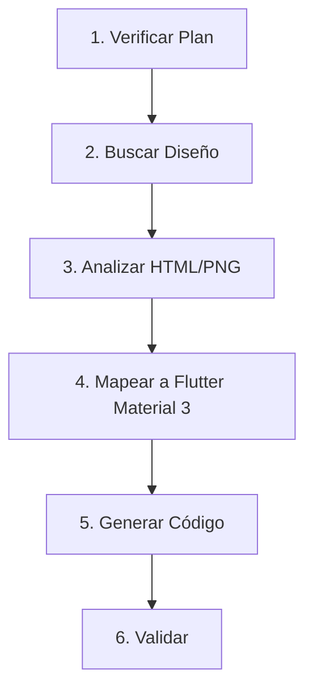

# /design-to-code $feature

Convierte un diseño de Google Stitch (HTML con Tailwind CSS) a código Flutter
siguiendo el estilo **Material Design 3** de FutPlanner.

---

## Flujo de Ejecución



---

## Prerequisitos

### 1. Plan de Implementación (RECOMENDADO)

```bash
# Puede existir en:
doc/plans/${feature}_plan.md
# o
doc/plans/feature_${feature}.md
```

Si no existe, el comando puede proceder pero se recomienda crear uno primero.

### 2. Diseño de Stitch (OBLIGATORIO)

```bash
# Estructura esperada en doc/design/:
doc/design/${feature}/
├── ${feature}_stitch_prompt.md    # Prompt usado para Stitch
└── ${feature}.html                # HTML generado por Stitch

# O en carpetas existentes:
doc/design/core/                   # Componentes core
doc/design/${feature}_feature/     # Feature específico
```

**IMPORTANTE**: NO modificar la estructura de `doc/design/`. Mantener el sistema de prompts existente.

---

## Pasos de Ejecución

### Paso 1: Verificar Prerequisitos

```bash
# Verificar que exista el diseño HTML
ls doc/design/**/${feature}*.html 2>/dev/null

# Verificar prompt de Stitch (para contexto)
ls doc/design/**/*_stitch_prompt.md 2>/dev/null
```

**Si falta el HTML**: Informar al usuario que debe generarlo en Stitch primero.

### Paso 2: Leer Contexto de Diseño

Antes de traducir, leer:

1. `.claude/design/DESIGN_SYSTEM.md` - Tokens de diseño
2. `.claude/design/COMPONENT_LIBRARY.md` - Componentes disponibles
3. `.claude/design/PROJECT_CONTEXT.md` - Contexto del usuario
4. `.claude/ui-adapter.md` - Mapeo de widgets existentes

### Paso 3: Analizar el Diseño HTML

Extraer del HTML:

1. **Estructura de Layout**
   - Tipo de página (list, detail, form, dashboard, bento)
   - Secciones principales
   - Componentes reutilizables

2. **Componentes Identificados**
   - Cards, botones, inputs, listas
   - Iconos utilizados (Material Symbols → Icons)
   - Estados (loading, empty, error)

3. **Estilos Tailwind**
   - Colores → Mapear a `colorScheme`
   - Espaciado → Mapear a valores estándar
   - Border radius → Usar constantes del tema
   - Responsive classes → Mapear a `AppLayoutBuilder`

### Paso 4: Validar Estilo FutPlanner

**Checklist de Validación:**

- [ ] ✅ Material Design 3 widgets
- [ ] ✅ Colores via `Theme.of(context).colorScheme`
- [ ] ✅ Dark mode soportado nativamente
- [ ] ✅ Verde FutPlanner (#10B981 light, #34D399 dark)
- [ ] ✅ Border radius: 6/10/16/24 px (tema)
- [ ] ✅ Textos con `context.lang`

### Paso 5: Generar Código Flutter

Usando el mapeo de `.claude/ui-adapter.md`:

```dart
// Estructura base para Page con Material 3
class ${Feature}Page extends StatelessWidget {
  const ${Feature}Page({super.key});

  @override
  Widget build(BuildContext context) {
    return BlocProvider(
      create: (context) => getIt<${Feature}Bloc>()..add(const ${Feature}Event.started()),
      child: const _${Feature}Content(),
    );
  }
}

class _${Feature}Content extends StatelessWidget {
  const _${Feature}Content();

  @override
  Widget build(BuildContext context) {
    return BlocBuilder<${Feature}Bloc, ${Feature}State>(
      builder: (context, state) {
        return state.when(
          initial: () => const SizedBox.shrink(),
          loading: (message) => LoadingOverlay(message: message),
          loaded: (data) => AppLayoutBuilder(
            mobile: ${Feature}MobileLayout(data: data),
            tablet: ${Feature}TabletLayout(data: data),
            desktop: ${Feature}DesktopLayout(data: data),
          ),
          error: (message) => FMErrorState(message: message),
        );
      },
    );
  }
}
```

### Paso 6: Generar Layouts Responsivos

Para cada breakpoint, crear layout separado:

```
lib/features/${feature}/presentation/
├── layouts/
│   ├── ${feature}_mobile_layout.dart
│   ├── ${feature}_tablet_layout.dart
│   └── ${feature}_desktop_layout.dart
├── widgets/
│   ├── ${feature}_header.dart
│   ├── ${feature}_card.dart
│   └── ${feature}_empty_state.dart
└── ${feature}_page.dart
```

### Paso 7: Generar Widgets Material 3

Para cada componente del diseño:

```dart
// Card estilo Material 3
Card(
  elevation: 0,
  shape: RoundedRectangleBorder(
    borderRadius: BorderRadius.circular(12),
    side: BorderSide(
      color: Theme.of(context).colorScheme.outline.withValues(alpha: 0.2),
    ),
  ),
  child: Padding(
    padding: const EdgeInsets.all(16),
    child: Column(
      crossAxisAlignment: CrossAxisAlignment.start,
      children: [
        Text(
          context.lang.featureTitle,
          style: Theme.of(context).textTheme.titleMedium?.copyWith(
            fontWeight: FontWeight.w600,
          ),
        ),
        // ...
      ],
    ),
  ),
)
```

### Paso 8: Agregar Traducciones

Actualizar `lib/l10n/app_es.arb` y `lib/l10n/app_en.arb`:

```json
{
  "featureTitle": "Título de la página",
  "@featureTitle": { "description": "Title for feature page" },
  "featureSubtitle": "Descripción",
  "featureEmptyState": "No hay registros"
}
```

Regenerar: `flutter gen-l10n`

### Paso 9: Validación Final

```bash
# 1. Regenerar código si hay Freezed
dart run build_runner build --delete-conflicting-outputs

# 2. Regenerar traducciones
flutter gen-l10n

# 3. Analizar errores
flutter analyze lib/features/${feature}/
```

---

## Mapeo de Referencia Rápida

### Tailwind → Flutter (Material 3)

| Tailwind | Flutter Material 3 |
|----------|-------------------|
| `p-4` | `EdgeInsets.all(16)` |
| `gap-4` | `SizedBox(height/width: 16)` |
| `rounded-lg` | `BorderRadius.circular(10)` |
| `rounded-xl` | `BorderRadius.circular(16)` |
| `text-gray-900` | `colorScheme.onSurface` |
| `text-gray-500` | `colorScheme.onSurfaceVariant` |
| `bg-white` | `colorScheme.surface` |
| `bg-gray-50` | `colorScheme.surfaceContainerHighest` |
| `border-gray-200` | `colorScheme.outlineVariant` |
| `text-green-500` | `colorScheme.primary` |
| `text-yellow-500` | `Colors.orange` |
| `text-red-500` | `colorScheme.error` |

### Colores FutPlanner

| Tailwind | Material 3 ColorScheme |
|----------|------------------------|
| `bg-green-500` / `#10B981` | `colorScheme.primary` |
| `bg-green-600` / `#059669` | `colorScheme.primary` (dark) |
| `bg-amber-500` / `#F59E0B` | `Colors.orange` |
| `bg-red-500` / `#EF4444` | `colorScheme.error` |
| `bg-blue-500` / `#3B82F6` | `Colors.blue` |
| `#1A1A1A` (dark bg) | `Colors.black` |
| `#2D2D2D` (dark cards) | `colorScheme.surfaceContainerLow` |

### Componentes HTML → Flutter Material 3

| HTML/Tailwind | Flutter Widget |
|---------------|----------------|
| `<div class="flex">` | `Row` / `Column` |
| `<div class="grid grid-cols-2">` | `GridView` o `Wrap` |
| `<button>` primario | `FilledButton` |
| `<button>` secundario | `TextButton` |
| `<button>` outline | `OutlinedButton` |
| `<input>` | `TextField` |
| `<select>` | `DropdownMenu` / `showModalBottomSheet` |
| Card con shadow | `Card` con `elevation: 1-2` |
| Card con border | `Card` con `shape: RoundedRectangleBorder` |
| Loading spinner | `CircularProgressIndicator` |
| Toggle | `Switch` |
| Slider | `Slider` |
| Alert | `AlertDialog` via `showDialog()` |

### Widgets Core Disponibles

Consultar `.claude/ui-adapter.md` para lista completa. Widgets principales:

| Componente | Widget FutPlanner |
|------------|-------------------|
| Card | `FMCard` |
| Bento Card | `BentoCard`, `BentoFeatureCard` |
| Player Card | `FMPlayerCard`, `PlayerCard` |
| Chip | `FMChip` / `FilterChip` |
| Form Field | `FMFormField` |
| Empty State | `FMEmptyState` |
| Error State | `FMErrorState` |
| Loading | `FMLoadingState`, `LoadingOverlay` |
| Dialog | `FMConfirmationDialog` |
| Layout Builder | `AppLayoutBuilder` |

---

## Responsividad

### Breakpoints (usar AppLayoutBuilder)

| Tailwind | AppLayoutBuilder | Valor |
|----------|------------------|-------|
| `sm:` / mobile | `mobile:` | < 600px |
| `md:` / tablet | `tablet:` | 600-1023px |
| `lg:` / desktop | `desktop:` | ≥ 1024px |

### Patrón Responsivo

```dart
// En la PAGE principal
AppLayoutBuilder(
  mobile: FeatureMobileLayout(state: state),
  tablet: FeatureTabletLayout(state: state),
  desktop: FeatureDesktopLayout(state: state),
)
```

---

## Ejemplo Completo: Dashboard Bento Card

### Diseño Stitch (HTML)
```html
<div class="bg-white rounded-xl border border-gray-200 p-4 hover:shadow-lg transition-shadow">
  <div class="flex items-center gap-2 text-gray-500 text-sm">
    <span class="material-symbols-outlined text-xl">people</span>
    Jugadores
  </div>
  <div class="mt-3 text-3xl font-bold text-gray-900">22</div>
  <div class="mt-1 text-sm text-green-500">+2 esta semana</div>
</div>
```

### Flutter Material 3 Traducido
```dart
Card(
  elevation: 0,
  shape: RoundedRectangleBorder(
    borderRadius: BorderRadius.circular(12),
    side: BorderSide(
      color: Theme.of(context).colorScheme.outline.withValues(alpha: 0.2),
    ),
  ),
  child: Padding(
    padding: const EdgeInsets.all(16),
    child: Column(
      crossAxisAlignment: CrossAxisAlignment.start,
      children: [
        Row(
          children: [
            Icon(
              Icons.people_outline,
              size: 20,
              color: Theme.of(context).colorScheme.onSurfaceVariant,
            ),
            const SizedBox(width: 8),
            Text(
              context.lang.dashboardPlayers,
              style: TextStyle(
                fontSize: 14,
                color: Theme.of(context).colorScheme.onSurfaceVariant,
              ),
            ),
          ],
        ),
        const SizedBox(height: 12),
        Text(
          '22',
          style: TextStyle(
            fontSize: 28,
            fontWeight: FontWeight.bold,
            color: Theme.of(context).colorScheme.onSurface,
          ),
        ),
        const SizedBox(height: 4),
        Text(
          '+2 ${context.lang.dashboardThisWeek}',
          style: TextStyle(
            fontSize: 14,
            color: Theme.of(context).colorScheme.primary,
          ),
        ),
      ],
    ),
  ),
)
```

---

## Errores Comunes

| Error | Solución |
|-------|----------|
| Diseño no encontrado | Generar en Stitch y guardar en `doc/design/{feature}/` |
| Colores hardcodeados | Usar `Theme.of(context).colorScheme` |
| Strings hardcodeados | Usar `context.lang` |
| Sin dark mode | Usar `colorScheme` que soporta automáticamente dark mode |
| Layout no responsivo | Usar `AppLayoutBuilder` con 3 layouts separados |

---

## Referencias

- **UI Adapter**: `.claude/ui-adapter.md`
- **Design System**: `.claude/design/DESIGN_SYSTEM.md`
- **Component Library**: `.claude/design/COMPONENT_LIBRARY.md`
- **Project Context**: `.claude/design/PROJECT_CONTEXT.md`
- **Tema Material**: `lib/core/theme/futplanner_material_theme.dart`
- **Convenciones**: `.claude/memory/CONVENTIONS.md`

---

## Estructura de Diseño (NO MODIFICAR)

```
doc/design/
├── core/
│   └── core_prompt.md               # Prompt base consolidado
└── {feature_name}/                  # Una carpeta por feature
    ├── {feature}_stitch_prompt.md   # Prompt para Stitch
    └── {feature}.html               # HTML generado por Stitch
```

**REGLA**: Mantener esta estructura. El comando lee de aquí pero NO modifica los prompts.

---

## Post-Ejecución

```bash
# 1. Build runner (si hay Freezed)
dart run build_runner build --delete-conflicting-outputs

# 2. Regenerar traducciones
flutter gen-l10n

# 3. Analizar
flutter analyze

# 4. Validar con QA
/futplanner-validate $feature
```
