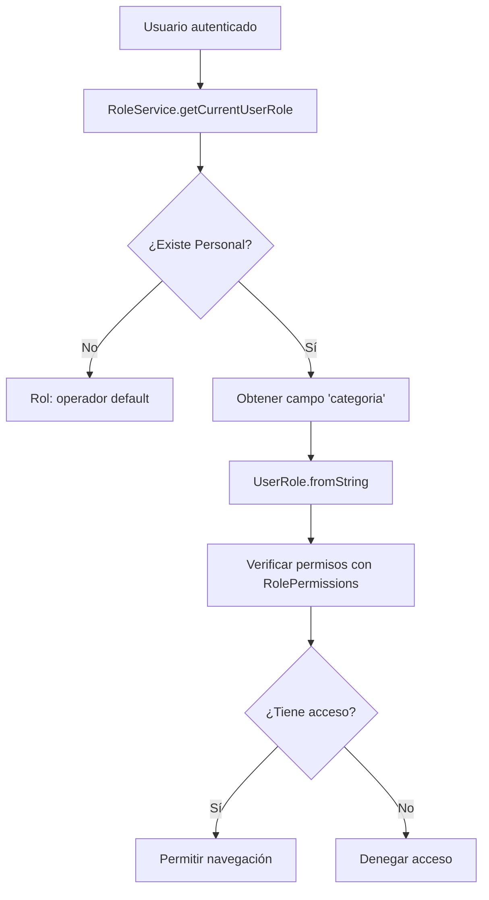

# 🔐 Sistema de Roles y Permisos - AmbuTrack

**Fecha de Creación**: 2025-12-26
**Versión**: 1.0
**Estado**: ✅ Implementado

---

## 📋 Resumen Ejecutivo

El sistema de roles de AmbuTrack implementa **10 roles** con permisos granulares sobre **50+ módulos** de la aplicación. Utiliza una arquitectura basada en **enums** y **mapas de permisos** para control de acceso.

### Características Principales

- ✅ **10 roles predefinidos** con responsabilidades claras
- ✅ **50+ módulos** con permisos granulares
- ✅ **Verificación en tiempo real** con cache de 5 minutos
- ✅ **Integración con Supabase Auth** y tabla `tpersonal`
- ✅ **Role Service** inyectable con GetIt
- ✅ **Compatible con GoRouter** para protección de rutas

---

## 🎯 Roles Disponibles (10 total)

### 1️⃣ Admin (`admin`)

**Descripción**: Acceso total al sistema

**Módulos de Acceso**: **TODOS** (50+ módulos)

**Casos de Uso**:
- Configuración del sistema
- Gestión de usuarios y roles
- Acceso a auditorías y logs
- Configuración avanzada

---

### 2️⃣ Jefe de Personal (`jefe_personal`)

**Descripción**: Gestión RRHH, turnos, ausencias y vacaciones

**Módulos de Acceso**:
- ✅ Personal completo (gestión de empleados)
- ✅ Formación y certificaciones
- ✅ Documentación de personal
- ✅ Ausencias y vacaciones
- ✅ Evaluaciones de desempeño
- ✅ Historial médico
- ✅ Equipamiento del personal
- ✅ Turnos y cuadrantes
- ✅ Plantillas de turnos
- ✅ Dotaciones
- ✅ Asignaciones
- ✅ Reportes de personal

**Casos de Uso**:
- Contratar nuevo personal
- Gestionar ausencias y vacaciones
- Configurar turnos y horarios
- Evaluar desempeño del equipo

---

### 3️⃣ Jefe de Tráfico (`jefe_trafico`)

**Descripción**: Operaciones, servicios y vehículos

**Módulos de Acceso**:
- ✅ Servicios (todos)
- ✅ Pacientes
- ✅ Urgentes en tiempo real
- ✅ Planificar servicios
- ✅ Histórico de servicios
- ✅ Vehículos (todos)
- ✅ Mantenimiento
- ✅ ITV y revisiones
- ✅ Documentación de vehículos
- ✅ Geolocalización
- ✅ Consumo y km
- ✅ Historial de averías
- ✅ Stock de equipamiento
- ✅ Cuadrantes
- ✅ Dotaciones
- ✅ Asignaciones
- ✅ Bases
- ✅ Operaciones
- ✅ Incidencias
- ✅ Reportes de servicios
- ✅ Estadísticas de flota

**Casos de Uso**:
- Planificar servicios diarios
- Asignar vehículos a servicios
- Gestionar urgencias
- Supervisar operaciones en tiempo real

---

### 4️⃣ Coordinador (`coordinador`)

**Descripción**: Supervisión operativa e incidencias

**Módulos de Acceso**:
- ✅ Servicios (consulta y urgentes)
- ✅ Urgentes en tiempo real
- ✅ Histórico de servicios
- ✅ Cuadrantes
- ✅ Operaciones
- ✅ Incidencias
- ✅ Comunicaciones

**Casos de Uso**:
- Supervisar servicios en curso
- Gestionar incidencias
- Coordinar comunicaciones
- Consultar cuadrantes

---

### 5️⃣ Administrativo (`administrativo`)

**Descripción**: Gestión documental y contratos

**Módulos de Acceso**:
- ✅ Contratos
- ✅ Documentación de personal
- ✅ Documentación de vehículos
- ✅ Personal (solo lectura)
- ✅ Vehículos (solo lectura)
- ✅ Calendario

**Casos de Uso**:
- Gestionar contratos con centros hospitalarios
- Administrar documentación
- Consultar información de personal/vehículos
- Calendario de eventos

---

### 6️⃣ Conductor (`conductor`)

**Descripción**: Acceso a datos propios

**Módulos de Acceso**:
- ✅ Mis Turnos
- ✅ Mis Servicios
- ✅ Mis Ausencias

**Casos de Uso**:
- Ver mis turnos asignados
- Consultar servicios realizados
- Solicitar ausencias

---

### 7️⃣ Sanitario (`sanitario`)

**Descripción**: Acceso a datos propios

**Módulos de Acceso**:
- ✅ Mis Turnos
- ✅ Mis Servicios
- ✅ Mis Ausencias

**Casos de Uso**:
- Ver mis turnos asignados
- Consultar servicios realizados
- Solicitar ausencias

---

### 8️⃣ Gestor (`gestor`)

**Descripción**: Gestión de flota (rol heredado)

**Módulos de Acceso**:
- ✅ Vehículos
- ✅ Mantenimiento
- ✅ ITV y revisiones
- ✅ Documentación de vehículos
- ✅ Consumo y km
- ✅ Historial de averías
- ✅ Stock de equipamiento
- ✅ Estadísticas de flota

**Casos de Uso**:
- Gestionar flota de vehículos
- Planificar mantenimientos
- Controlar ITVs
- Analizar estadísticas de flota

---

### 9️⃣ Técnico (`tecnico`)

**Descripción**: Mantenimiento (rol heredado)

**Módulos de Acceso**:
- ✅ Mantenimiento
- ✅ ITV y revisiones
- ✅ Historial de averías
- ✅ Stock de equipamiento

**Casos de Uso**:
- Registrar mantenimientos
- Actualizar ITVs
- Reportar averías
- Gestionar repuestos

---

### 🔟 Operador (`operador`)

**Descripción**: Solo lectura (rol heredado)

**Módulos de Acceso**:
- ✅ Personal (solo lectura)
- ✅ Vehículos (solo lectura)
- ✅ Servicios (solo lectura)

**Casos de Uso**:
- Consultar información
- Sin permisos de modificación

---

## 🏗️ Arquitectura del Sistema

### Componentes Principales

```
lib/core/auth/
├── enums/
│   ├── user_role.dart          # Enum de 10 roles
│   └── app_module.dart         # Enum de 50+ módulos
├── permissions/
│   └── role_permissions.dart   # Mapa rol → módulos
└── services/
    └── role_service.dart       # Servicio de verificación
```

### Flujo de Verificación de Permisos



---

## 🛠️ Uso del Sistema

### 1. Inyectar RoleService

```dart
// En widget o BLoC
final RoleService roleService = getIt<RoleService>();
```

### 2. Verificar Acceso a Módulo

```dart
// Verificar acceso a un módulo específico
final bool hasAccess = await roleService.hasAccessToModule(AppModule.personal);

if (hasAccess) {
  // Permitir acceso
} else {
  // Denegar acceso
}
```

### 3. Verificar Acceso a Ruta

```dart
// Verificar acceso a una ruta
final bool canAccess = await roleService.hasAccessToRoute('/personal/formacion');

if (canAccess) {
  context.goNamed('personal_formacion');
} else {
  ScaffoldMessenger.of(context).showSnackBar(
    SnackBar(content: Text('No tienes permisos para acceder a este módulo')),
  );
}
```

### 4. Obtener Rol del Usuario Actual

```dart
final UserRole role = await roleService.getCurrentUserRole();

if (role.isAdmin) {
  // Mostrar opciones de administración
}

if (role.isManager) {
  // Mostrar opciones de gestión
}

if (role.isOperative) {
  // Mostrar opciones operativas (conductor/sanitario)
}
```

### 5. Obtener Módulos Permitidos

```dart
final List<AppModule> allowedModules = await roleService.getAllowedModules();

// Filtrar menú según módulos permitidos
final List<MenuItem> menuItems = allMenuItems.where((item) {
  final AppModule? module = AppModule.fromString(item.key);
  return module != null && allowedModules.contains(module);
}).toList();
```

---

## 🔗 Integración con GoRouter

### Proteger Rutas por Rol

```dart
// En app_router.dart
GoRoute(
  path: '/administracion/usuarios-roles',
  name: 'usuarios_roles',
  builder: (context, state) => const UsuariosRolesPage(),
  redirect: (BuildContext context, GoRouterState state) async {
    final RoleService roleService = getIt<RoleService>();
    final bool hasAccess = await roleService.hasAccessToRoute('/administracion/usuarios-roles');

    if (!hasAccess) {
      return '/'; // Redirigir a dashboard si no tiene acceso
    }

    return null; // Permitir navegación
  },
),
```

### Middleware de Permisos

```dart
// Crear un redirect global para todas las rutas protegidas
String? Function(BuildContext, GoRouterState) get _roleGuard {
  return (BuildContext context, GoRouterState state) async {
    final RoleService roleService = getIt<RoleService>();
    final String path = state.matchedLocation;

    // Dashboard siempre accesible
    if (path == '/' || path == '/dashboard') {
      return null;
    }

    final bool hasAccess = await roleService.hasAccessToRoute(path);

    if (!hasAccess) {
      return '/'; // Redirigir a dashboard
    }

    return null;
  };
}
```

---

## 📊 Tabla de Permisos Completa

### Matriz de Roles x Módulos

| Módulo | admin | jefe_personal | jefe_trafico | coordinador | administrativo | conductor | sanitario | gestor | tecnico | operador |
|--------|-------|---------------|--------------|-------------|----------------|-----------|-----------|--------|---------|----------|
| **Dashboard** | ✅ | ✅ | ✅ | ✅ | ✅ | ✅ | ✅ | ✅ | ✅ | ✅ |
| **Personal** | ✅ | ✅ | ❌ | ❌ | 📖 | ❌ | ❌ | ❌ | ❌ | 📖 |
| **Turnos** | ✅ | ✅ | ❌ | ❌ | ❌ | ❌ | ❌ | ❌ | ❌ | ❌ |
| **Servicios** | ✅ | ❌ | ✅ | ✅ | ❌ | ❌ | ❌ | ❌ | ❌ | 📖 |
| **Vehículos** | ✅ | ❌ | ✅ | ❌ | 📖 | ❌ | ❌ | ✅ | ❌ | 📖 |
| **Mantenimiento** | ✅ | ❌ | ✅ | ❌ | ❌ | ❌ | ❌ | ✅ | ✅ | ❌ |
| **Operaciones** | ✅ | ❌ | ✅ | ✅ | ❌ | ❌ | ❌ | ❌ | ❌ | ❌ |
| **Contratos** | ✅ | ❌ | ❌ | ❌ | ✅ | ❌ | ❌ | ❌ | ❌ | ❌ |
| **Mis Turnos** | ✅ | ❌ | ❌ | ❌ | ❌ | ✅ | ✅ | ❌ | ❌ | ❌ |
| **Administración** | ✅ | ❌ | ❌ | ❌ | ❌ | ❌ | ❌ | ❌ | ❌ | ❌ |

**Leyenda**:
- ✅ = Acceso completo (lectura + escritura)
- 📖 = Solo lectura
- ❌ = Sin acceso

---

## 🗄️ Modelo de Datos

### Campo `categoria` en `tpersonal`

El rol se almacena en el campo `categoria` de la tabla `tpersonal`:

```sql
-- Tabla tpersonal en Supabase
CREATE TABLE tpersonal (
  id UUID PRIMARY KEY,
  nombre VARCHAR NOT NULL,
  apellidos VARCHAR NOT NULL,
  usuario_id UUID REFERENCES auth.users(id), -- Vincula con Supabase Auth
  categoria VARCHAR, -- Rol del usuario: 'admin', 'jefe_personal', etc.
  activo BOOLEAN DEFAULT true,
  -- ... otros campos
);
```

### Valores Válidos para `categoria`

```sql
-- Valores permitidos en campo 'categoria'
'admin'
'jefe_personal'
'jefe_trafico'
'coordinador'
'administrativo'
'conductor'
'sanitario'
'gestor'
'tecnico'
'operador'
```

---

## 🔄 Casos de Uso Comunes

### Caso 1: Ocultar Opciones de Menú según Rol

```dart
// En MenuWidget
final RoleService roleService = getIt<RoleService>();
final List<AppModule> allowedModules = await roleService.getAllowedModules();

// Filtrar opciones de menú
final List<MenuItem> visibleMenuItems = allMenuItems.where((item) {
  final AppModule? module = AppModule.fromString(item.moduleKey);
  if (module == null) return true; // Mostrar si no tiene módulo asociado

  return allowedModules.contains(module);
}).toList();
```

### Caso 2: Mostrar Botón Solo a Administradores

```dart
// En formulario
final RoleService roleService = getIt<RoleService>();
final bool isAdmin = await roleService.isAdmin();

if (isAdmin) {
  ElevatedButton(
    onPressed: () => _deleteAll(),
    child: Text('Eliminar Todo'),
  ),
}
```

### Caso 3: Validar Acceso antes de Ejecutar Acción

```dart
// Antes de aprobar una vacación
final RoleService roleService = getIt<RoleService>();
final bool hasAccess = await roleService.hasAccessToModule(AppModule.vacaciones);

if (!hasAccess) {
  ScaffoldMessenger.of(context).showSnackBar(
    SnackBar(
      content: Text('No tienes permisos para aprobar vacaciones'),
      backgroundColor: AppColors.error,
    ),
  );
  return;
}

// Continuar con aprobación...
```

### Caso 4: Filtrar Datos según Rol

```dart
// Conductor/Sanitario solo ve sus propios datos
final RoleService roleService = getIt<RoleService>();
final UserRole role = await roleService.getCurrentUserRole();

List<TurnoEntity> turnos;

if (role.isOperative) {
  // Filtrar solo turnos del usuario actual
  final PersonalEntity? personal = await roleService.getCurrentPersonal();
  turnos = await turnoRepository.getByPersonalId(personal!.id);
} else {
  // Jefes/coordinadores ven todos los turnos
  turnos = await turnoRepository.getAll();
}
```

---

## ✅ Checklist de Implementación

### Archivos Creados

- [x] `lib/core/auth/enums/user_role.dart`
- [x] `lib/core/auth/enums/app_module.dart`
- [x] `lib/core/auth/permissions/role_permissions.dart`
- [x] `lib/core/auth/services/role_service.dart`
- [x] `docs/arquitectura/sistema_roles.md`

### Configuración Pendiente

- [ ] Agregar campo `rol` a `PersonalEntity` (opcional, usar `categoria`)
- [ ] Configurar DI en `locator.dart` para `RoleService`
- [ ] Integrar con GoRouter para protección de rutas
- [ ] Actualizar menú para filtrar opciones según rol
- [ ] Crear página de Administración de Usuarios y Roles
- [ ] Ejecutar `flutter pub run build_runner build`
- [ ] Ejecutar `flutter analyze` (0 warnings)

---

## 🧪 Testing

### Ejemplo de Test para RoleService

```dart
import 'package:ambutrack_web/core/auth/enums/app_module.dart';
import 'package:ambutrack_web/core/auth/enums/user_role.dart';
import 'package:ambutrack_web/core/auth/services/role_service.dart';
import 'package:flutter_test/flutter_test.dart';
import 'package:mocktail/mocktail.dart';

void main() {
  group('RoleService', () {
    late RoleService roleService;
    late MockAuthService mockAuthService;
    late MockPersonalRepository mockPersonalRepository;

    setUp(() {
      mockAuthService = MockAuthService();
      mockPersonalRepository = MockPersonalRepository();
      roleService = RoleService(mockAuthService, mockPersonalRepository);
    });

    test('Admin tiene acceso a todos los módulos', () async {
      // Arrange
      when(() => mockAuthService.currentUser).thenReturn(mockUser);
      when(() => mockPersonalRepository.getAll()).thenAnswer(
        (_) async => [mockPersonalAdmin],
      );

      // Act
      final bool hasAccess = await roleService.hasAccessToModule(AppModule.personal);

      // Assert
      expect(hasAccess, true);
    });

    test('Conductor solo tiene acceso a módulos propios', () async {
      // Arrange
      when(() => mockAuthService.currentUser).thenReturn(mockUser);
      when(() => mockPersonalRepository.getAll()).thenAnswer(
        (_) async => [mockPersonalConductor],
      );

      // Act
      final bool hasAccessPersonal = await roleService.hasAccessToModule(AppModule.personal);
      final bool hasAccessMisTurnos = await roleService.hasAccessToModule(AppModule.misTurnos);

      // Assert
      expect(hasAccessPersonal, false);
      expect(hasAccessMisTurnos, true);
    });
  });
}
```

---

## 📚 Referencias

- [Personal Entity](../../lib/features/personal/domain/entities/personal_entity.dart)
- [Auth Service](../../lib/core/services/auth_service.dart)
- [GoRouter](../../lib/core/router/app_router.dart)
- [Menú Repository](../../lib/features/menu/data/repositories/menu_repository_impl.dart)

---

**Documento generado el**: 2025-12-26
**Autor**: Sistema AmbuTrack
**Próxima revisión**: Después de integrar con GoRouter
