# Notificaciones Inversas: Mobile → Web

## 📋 Resumen

Sistema de notificaciones que permite a los usuarios de la aplicación móvil notificar a los jefes de personal (usuarios web) cuando crean trámites como solicitudes de vacaciones o ausencias.

**Flujo**: Usuario mobile crea trámite → Notificación automática → Jefe de personal recibe notificación en web

---

## 🏗️ Arquitectura

### Componentes Involucrados

```
┌─────────────────────────────────────────────────────────────┐
│                     MOBILE APP                               │
├─────────────────────────────────────────────────────────────┤
│  1. Usuario crea trámite (vacaciones/ausencia)              │
│     ↓                                                        │
│  2. VacacionesBloc / AusenciasBloc                           │
│     ↓                                                        │
│  3. NotificacionesRepository.notificarJefesPersonal()        │
│     ↓                                                        │
│  4. NotificacionesDataSource (ambutrack_core)                │
└─────────────────────────────────────────────────────────────┘
                             ↓
                    ┌────────────────┐
                    │   SUPABASE DB  │
                    │ tnotificaciones│
                    └────────────────┘
                             ↓
┌─────────────────────────────────────────────────────────────┐
│                      WEB APP                                 │
├─────────────────────────────────────────────────────────────┤
│  1. NotificacionBloc (escucha Realtime)                      │
│     ↓                                                        │
│  2. Badge en AppBar (contador)                               │
│     ↓                                                        │
│  3. Panel de notificaciones (al hacer clic)                  │
│     ↓                                                        │
│  4. Jefe de personal ve la notificación                      │
└─────────────────────────────────────────────────────────────┘
```

---

## 🔧 Implementación

### 1. **Entidad de Notificación** (ambutrack_core)

```dart
// packages/ambutrack_core/lib/src/datasources/notificaciones/entities/notificacion_entity.dart

class NotificacionEntity {
  final String id;
  final String empresaId;
  final String usuarioDestinoId;  // ID del jefe de personal
  final NotificacionTipo tipo;    // vacacion_solicitada, ausencia_solicitada
  final String titulo;
  final String mensaje;
  final String? entidadTipo;      // 'vacacion', 'ausencia'
  final String? entidadId;        // ID del trámite
  final bool leida;
  final Map<String, dynamic> metadata;  // Datos adicionales
  final DateTime createdAt;
}

enum NotificacionTipo {
  vacacionSolicitada('vacacion_solicitada', 'Solicitud de Vacaciones'),
  ausenciaSolicitada('ausencia_solicitada', 'Solicitud de Ausencia'),
  // ... otros tipos
}
```

### 2. **DataSource de Notificaciones** (ambutrack_core)

```dart
// packages/ambutrack_core/lib/src/datasources/notificaciones/implementations/supabase/supabase_notificaciones_datasource.dart

class SupabaseNotificacionesDataSource {
  /// Notifica a todos los jefes de personal
  Future<void> notificarJefesPersonal({
    required String tipo,
    required String titulo,
    required String mensaje,
    String? entidadTipo,
    String? entidadId,
    Map<String, dynamic> metadata = const {},
  }) async {
    // 1. Buscar jefes de personal en tpersonal
    final personalResponse = await _client
        .from('tpersonal')
        .select('usuario_id')
        .inFilter('categoria', ['admin', 'jefe_personal', 'jefe_trafico'])
        .eq('activo', true);

    // 2. Crear una notificación para cada jefe
    for (final p in personalResponse) {
      final notificacion = NotificacionEntity(
        id: '', // Se genera automáticamente en BD
        empresaId: _empresaId,
        usuarioDestinoId: p['usuario_id'],
        tipo: NotificacionTipo.fromString(tipo),
        titulo: titulo,
        mensaje: mensaje,
        entidadTipo: entidadTipo,
        entidadId: entidadId,
        leida: false,
        metadata: metadata,
        createdAt: DateTime.now(),
      );

      await create(notificacion);
    }
  }
}
```

**Criterios para ser notificado:**
- Usuario con rol: `admin`, `jefe_personal` o `jefe_trafico`
- Estado activo: `activo = true`
- Tabla: `tpersonal`

---

### 3. **Repository Mobile**

```dart
// apps/mobile/lib/features/notificaciones/data/repositories/notificaciones_repository_impl.dart

class NotificacionesRepositoryImpl {
  final NotificacionesDataSource _dataSource;

  Future<void> notificarJefesPersonal({
    required String tipo,
    required String titulo,
    required String mensaje,
    String? entidadTipo,
    String? entidadId,
    Map<String, dynamic> metadata = const {},
  }) async {
    await _dataSource.notificarJefesPersonal(
      tipo: tipo,
      titulo: titulo,
      mensaje: mensaje,
      entidadTipo: entidadTipo,
      entidadId: entidadId,
      metadata: metadata,
    );
    // NO hacemos rethrow si falla - no queremos romper el flujo principal
  }
}
```

---

### 4. **BLoC de Vacaciones (Mobile)**

```dart
// apps/mobile/lib/features/tramites/presentation/bloc/vacaciones_bloc.dart

class VacacionesBloc extends Bloc<VacacionesEvent, VacacionesState> {
  final VacacionesRepository _repository;
  final NotificacionesRepository _notificacionesRepository;
  final AuthBloc _authBloc;

  Future<void> _onCreateRequested(event, emit) async {
    // 1. Crear vacación
    final created = await _repository.create(event.vacacion);

    // 2. Si está pendiente, notificar a jefes
    if (created.estado == 'pendiente') {
      await _notificarNuevaVacacion(created);
    }

    emit(VacacionCreated(created));
  }

  Future<void> _notificarNuevaVacacion(VacacionesEntity vacacion) async {
    // Obtener datos del usuario autenticado
    final authState = _authBloc.state;
    if (authState is! AuthAuthenticated || authState.personal == null) return;

    final personal = authState.personal!;
    final nombrePersonal = '${personal.nombre} ${personal.apellidos}'.trim();

    // Crear notificación
    await _notificacionesRepository.notificarJefesPersonal(
      tipo: 'vacacion_solicitada',
      titulo: 'Nueva Solicitud de Vacaciones',
      mensaje: '$nombrePersonal ha solicitado ${vacacion.diasSolicitados} días de vacaciones',
      entidadTipo: 'vacacion',
      entidadId: vacacion.id,
      metadata: {
        'personal_id': vacacion.idPersonal,
        'personal_nombre': nombrePersonal,
        'fecha_inicio': vacacion.fechaInicio.toIso8601String(),
        'fecha_fin': vacacion.fechaFin.toIso8601String(),
        'dias': vacacion.diasSolicitados,
      },
    );
  }
}
```

---

### 5. **BLoC de Ausencias (Mobile)**

```dart
// apps/mobile/lib/features/tramites/presentation/bloc/ausencias_bloc.dart

class AusenciasBloc extends Bloc<AusenciasEvent, AusenciasState> {
  final AusenciasRepository _ausenciasRepository;
  final TiposAusenciaRepository _tiposRepository;
  final NotificacionesRepository _notificacionesRepository;
  final AuthBloc _authBloc;

  Future<void> _onCreateRequested(event, emit) async {
    // 1. Crear ausencia
    final created = await _ausenciasRepository.create(event.ausencia);

    // 2. Si está pendiente, notificar a jefes
    if (created.estado == EstadoAusencia.pendiente) {
      await _notificarNuevaAusencia(created);
    }

    emit(AusenciaCreated(created));
  }

  Future<void> _notificarNuevaAusencia(AusenciaEntity ausencia) async {
    final authState = _authBloc.state;
    if (authState is! AuthAuthenticated || authState.personal == null) return;

    final personal = authState.personal!;
    final nombrePersonal = '${personal.nombre} ${personal.apellidos}'.trim();

    // Obtener tipo de ausencia para el mensaje
    String tipoAusenciaNombre = 'ausencia';
    try {
      final tipos = await _tiposRepository.getAll();
      final tipo = tipos.firstWhere((t) => t.id == ausencia.idTipoAusencia);
      tipoAusenciaNombre = tipo.nombre.toLowerCase();
    } catch (_) {}

    // Crear notificación
    await _notificacionesRepository.notificarJefesPersonal(
      tipo: 'ausencia_solicitada',
      titulo: 'Nueva Solicitud de Ausencia',
      mensaje: '$nombrePersonal ha solicitado $tipoAusenciaNombre: ${ausencia.motivo}',
      entidadTipo: 'ausencia',
      entidadId: ausencia.id,
      metadata: {
        'personal_id': ausencia.idPersonal,
        'personal_nombre': nombrePersonal,
        'tipo_ausencia_id': ausencia.idTipoAusencia,
        'tipo_ausencia_nombre': tipoAusenciaNombre,
        'fecha_inicio': ausencia.fechaInicio.toIso8601String(),
        'fecha_fin': ausencia.fechaFin.toIso8601String(),
        'motivo': ausencia.motivo,
      },
    );
  }
}
```

---

### 6. **Inyección de Dependencias (Mobile)**

```dart
// apps/mobile/lib/core/di/injection.dart

Future<void> configureDependencies() async {
  // Repositories
  getIt.registerLazySingleton<NotificacionesRepository>(
    () => NotificacionesRepositoryImpl(authBloc: getIt<AuthBloc>()),
  );

  // BLoCs con notificaciones
  getIt.registerFactory<VacacionesBloc>(
    () => VacacionesBloc(
      getIt<VacacionesRepository>(),
      getIt<NotificacionesRepository>(),  // ← Nuevo
      getIt<AuthBloc>(),                  // ← Nuevo
    ),
  );

  getIt.registerFactory<AusenciasBloc>(
    () => AusenciasBloc(
      getIt<AusenciasRepository>(),
      getIt<TiposAusenciaRepository>(),
      getIt<NotificacionesRepository>(),  // ← Nuevo
      getIt<AuthBloc>(),                  // ← Nuevo
    ),
  );
}
```

---

### 7. **BLoC de Notificaciones (Web)**

```dart
// apps/web/lib/features/notificaciones/presentation/bloc/notificacion_bloc.dart

class NotificacionBloc extends Bloc<NotificacionEvent, NotificacionState> {
  final NotificacionesRepository _repository;

  on<NotificacionEvent>((event, emit) {
    event.when(
      subscribeNotificaciones: (userId) async {
        emit(const NotificacionState.loading());

        // Stream en tiempo real desde Supabase
        await emit.forEach(
          _repository.watchNotificaciones(userId),
          onData: (notificaciones) {
            final conteoNoLeidas = notificaciones.where((n) => !n.leida).length;
            return NotificacionState.loaded(
              notificaciones: notificaciones,
              conteoNoLeidas: conteoNoLeidas,
            );
          },
          onError: (error, stackTrace) =>
              NotificacionState.error(message: error.toString()),
        );
      },
    );
  });
}
```

---

### 8. **Panel de Notificaciones (Web)**

```dart
// apps/web/lib/features/notificaciones/presentation/widgets/notificaciones_panel.dart

class NotificacionesPanel extends StatelessWidget {
  Widget build(BuildContext context) {
    return BlocProvider(
      create: (context) => NotificacionBloc(context.read())
        ..add(NotificacionEvent.subscribeNotificaciones(userId)),
      child: BlocBuilder<NotificacionBloc, NotificacionState>(
        builder: (context, state) {
          return state.map(
            loaded: (loaded) => Column(
              children: [
                // Header con contador
                _Header(conteoNoLeidas: loaded.conteoNoLeidas),

                // Lista de notificaciones
                ListView.separated(
                  itemCount: loaded.notificaciones.length,
                  itemBuilder: (context, index) {
                    final notif = loaded.notificaciones[index];
                    return NotificacionCard(
                      notificacion: notif,
                      onMarkAsRead: () => context.read<NotificacionBloc>().add(
                        NotificacionEvent.marcarComoLeida(notif.id),
                      ),
                    );
                  },
                ),

                // Botón "Marcar todas como leídas"
                if (loaded.conteoNoLeidas > 0)
                  _MarkAllButton(conteoNoLeidas: loaded.conteoNoLeidas),
              ],
            ),
          );
        },
      ),
    );
  }
}
```

---

## 📊 Base de Datos

### Tabla: `tnotificaciones`

```sql
CREATE TABLE tnotificaciones (
    id UUID PRIMARY KEY DEFAULT uuid_generate_v4(),
    empresa_id TEXT NOT NULL,
    usuario_destino_id UUID NOT NULL REFERENCES auth.users(id),
    tipo TEXT NOT NULL,
    titulo TEXT NOT NULL,
    mensaje TEXT NOT NULL,
    entidad_tipo TEXT,           -- 'vacacion', 'ausencia', etc.
    entidad_id TEXT,              -- ID del trámite
    leida BOOLEAN DEFAULT FALSE,
    fecha_lectura TIMESTAMPTZ,
    metadata JSONB DEFAULT '{}'::jsonb,
    created_at TIMESTAMPTZ DEFAULT NOW(),
    updated_at TIMESTAMPTZ DEFAULT NOW()
);

-- Índices para optimizar consultas
CREATE INDEX idx_notificaciones_usuario_destino
    ON tnotificaciones(usuario_destino_id);

CREATE INDEX idx_notificaciones_leida
    ON tnotificaciones(usuario_destino_id, leida);

CREATE INDEX idx_notificaciones_tipo
    ON tnotificaciones(tipo);
```

### Tabla: `tpersonal`

```sql
-- Columnas relevantes para notificaciones
SELECT usuario_id, categoria, activo
FROM tpersonal
WHERE categoria IN ('admin', 'jefe_personal', 'jefe_trafico')
  AND activo = TRUE;
```

---

## 🔐 Seguridad (RLS Policies)

```sql
-- Policy: Usuarios solo ven sus propias notificaciones
CREATE POLICY "Users can view their own notifications"
ON tnotificaciones FOR SELECT
USING (usuario_destino_id = auth.uid());

-- Policy: Sistema puede crear notificaciones
CREATE POLICY "System can create notifications"
ON tnotificaciones FOR INSERT
WITH CHECK (true);

-- Policy: Usuarios pueden actualizar sus notificaciones (marcar como leída)
CREATE POLICY "Users can update their own notifications"
ON tnotificaciones FOR UPDATE
USING (usuario_destino_id = auth.uid());

-- Policy: Usuarios pueden eliminar sus notificaciones
CREATE POLICY "Users can delete their own notifications"
ON tnotificaciones FOR DELETE
USING (usuario_destino_id = auth.uid());
```

---

## 🔄 Flujo Completo

### Ejemplo: Solicitud de Vacaciones

```mermaid
sequenceDiagram
    participant U as Usuario Mobile
    participant VB as VacacionesBloc
    participant NR as NotificacionesRepo
    participant DS as DataSource (Core)
    participant DB as Supabase DB
    participant WB as NotificacionBloc Web
    participant J as Jefe Personal Web

    U->>VB: Solicita vacaciones (3 días)
    VB->>VB: Crea VacacionesEntity (estado: pendiente)
    VB->>DS: create(vacacion)
    DS->>DB: INSERT INTO tvacaciones
    DB-->>DS: vacacion_id
    DS-->>VB: VacacionesEntity creada

    VB->>VB: if estado == 'pendiente'
    VB->>NR: notificarJefesPersonal()
    NR->>DS: notificarJefesPersonal()
    DS->>DB: SELECT * FROM tpersonal WHERE categoria IN (...)
    DB-->>DS: [jefe1, jefe2]

    loop Para cada jefe
        DS->>DB: INSERT INTO tnotificaciones
        DB-->>WB: Realtime Event (NEW)
        WB->>WB: Actualiza estado (nueva notificación)
        WB->>J: Actualiza UI (badge +1)
    end

    DS-->>NR: OK
    NR-->>VB: OK (sin throw si falla)
    VB-->>U: Solicitud enviada ✅

    J->>J: Ve badge en AppBar
    J->>WB: Abre panel de notificaciones
    WB->>J: Muestra "Juan Pérez ha solicitado 3 días de vacaciones"
```



---

## 🎯 Tipos de Notificación Soportados

### Vacaciones
- **Tipo**: `vacacion_solicitada`
- **Título**: "Nueva Solicitud de Vacaciones"
- **Mensaje**: "{Nombre} ha solicitado {X} días de vacaciones ({fecha inicio} - {fecha fin})"
- **Metadata**:
  - `personal_id`
  - `personal_nombre`
  - `fecha_inicio`
  - `fecha_fin`
  - `dias`

### Ausencias
- **Tipo**: `ausencia_solicitada`
- **Título**: "Nueva Solicitud de Ausencia"
- **Mensaje**: "{Nombre} ha solicitado {tipo ausencia} ({fecha inicio} - {fecha fin}): {motivo}"
- **Metadata**:
  - `personal_id`
  - `personal_nombre`
  - `tipo_ausencia_id`
  - `tipo_ausencia_nombre`
  - `fecha_inicio`
  - `fecha_fin`
  - `motivo`

---

## 🧪 Testing

### Prueba Manual

1. **Mobile**:
   - Iniciar sesión como usuario normal
   - Ir a "Trámites" → "Solicitar Vacaciones"
   - Completar formulario (fechas, días)
   - Enviar solicitud

2. **Web**:
   - Iniciar sesión como jefe de personal
   - Verificar que aparece badge en campana (🔔)
   - Abrir panel de notificaciones
   - Verificar que aparece la solicitud

3. **Verificar en Supabase**:
   ```sql
   -- Ver notificaciones creadas
   SELECT * FROM tnotificaciones
   WHERE tipo = 'vacacion_solicitada'
   ORDER BY created_at DESC
   LIMIT 10;
   ```

---

## 📝 Notas Importantes

### Manejo de Errores

✅ **Correcto**: Si falla la notificación, NO romper el flujo principal
```dart
// En NotificacionesRepository
try {
  await _dataSource.notificarJefesPersonal(...);
} catch (e) {
  debugPrint('Error al notificar: $e');
  // NO hacemos rethrow - continuar flujo
}
```

❌ **Incorrecto**: Lanzar excepción que rompe la creación del trámite
```dart
await _dataSource.notificarJefesPersonal(...);  // Si falla, rompe todo
```

### Real-Time en Web

- El BLoC de web usa `watchNotificaciones()` que retorna un `Stream`
- Supabase Realtime envía eventos `INSERT`, `UPDATE`, `DELETE`
- El stream se actualiza automáticamente cuando hay cambios en BD

### Categorías de Personal

Las notificaciones se envían a usuarios con estas categorías:
- `admin` - Administradores del sistema
- `jefe_personal` - Jefes de personal
- `jefe_trafico` - Jefes de tráfico

Para agregar más categorías, modificar:
```dart
.inFilter('categoria', ['admin', 'jefe_personal', 'jefe_trafico', 'nueva_categoria'])
```

---

## 🚀 Futuras Mejoras

1. **Filtrado por empresa**: Si hay multi-tenancy, filtrar jefes por empresa
2. **Notificaciones push**: Enviar notificaciones push a móviles de jefes
3. **Configuración de notificaciones**: Permitir a jefes elegir qué notificaciones recibir
4. **Agregación**: Agrupar múltiples notificaciones similares
5. **Prioridades**: Notificaciones urgentes vs normales
6. **Plantillas**: Sistema de plantillas para mensajes más dinámicos

---

## 📚 Referencias

- **Código Mobile**: [apps/mobile/lib/features/tramites/](../apps/mobile/lib/features/tramites/)
- **Código Web**: [apps/web/lib/features/notificaciones/](../apps/web/lib/features/notificaciones/)
- **Core**: [packages/ambutrack_core/lib/src/datasources/notificaciones/](../packages/ambutrack_core/lib/src/datasources/notificaciones/)
- **Entidades**: [NotificacionEntity](../packages/ambutrack_core/lib/src/datasources/notificaciones/entities/notificacion_entity.dart)
